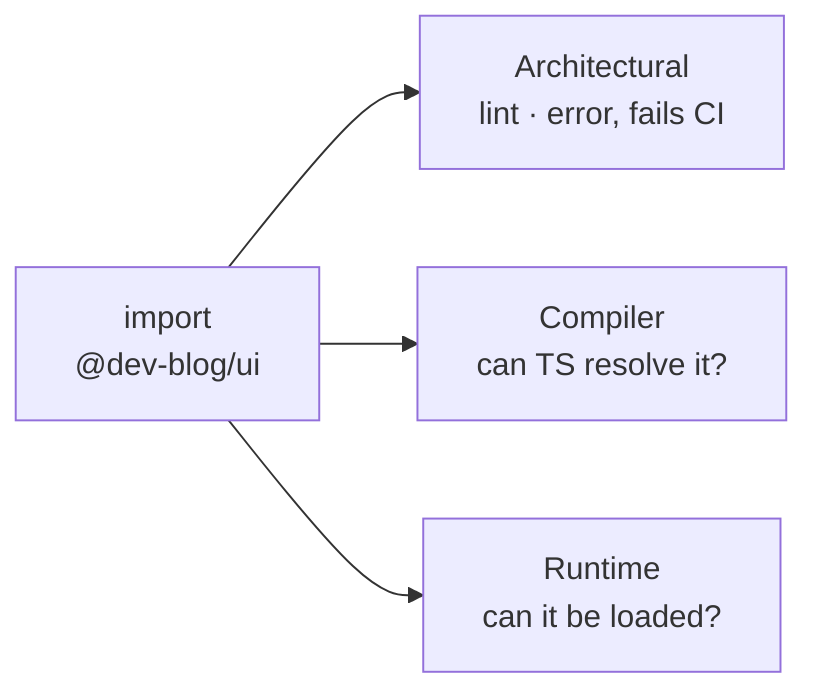
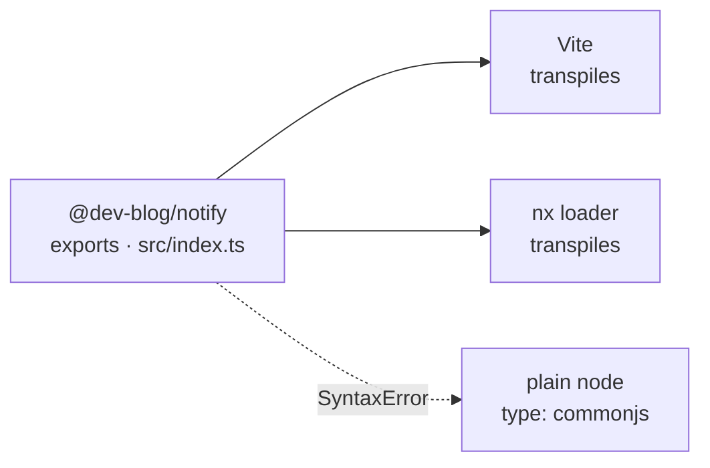
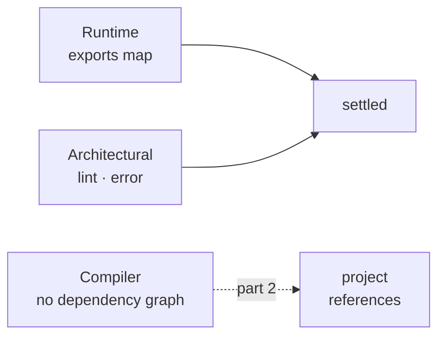

This repo has four libraries, one app and two nx plugins, and until I went
looking I could not have told you why `import { Button } from '@dev-blog/ui'`
works. It resolves in the editor, it resolves in the build, and
`@dev-blog/notify` — imported by a plugin that runs outside Vite — resolves
through something else again. "Can I import this?" is three questions wearing one
sentence, and in this repo each of them is answered by a different file.

## 1. Three boundaries

The **architectural** boundary asks whether the import is allowed. Here that is
`@nx/enforce-module-boundaries`, set to `error` in `eslint.config.mjs`, and lint
sits in the definition of done and in the CI job for `main` — so a violation
fails the build rather than printing a warning. It works off tags: a package
tagged `type:ui` may depend on `type:ui`, `type:theme` and `type:icons` and
nothing else, and `type:icons` may depend on nothing at all. It reads imports,
and that is where it stops. Nothing about it decides whether the code runs.

The **compiler-visibility** boundary asks whether TypeScript can resolve the
specifier and find types behind it. The **runtime** boundary asks whether the
thing executing the code can load the file it lands on. Those last two disagree
in this repo, and that disagreement is most of this article.



## 2. What makes a folder importable

There is no `paths` alias in this workspace. `grep '"paths"'` across every
tsconfig returns nothing, which surprised me, because the alias map is the thing
I would have said a monorepo is made of.

What is there instead: each folder is a real package. pnpm links it into
`node_modules` under its name, and its `package.json` publishes an **exports
map** that says which file each kind of consumer gets.

```json
{
  "name": "@dev-blog/ui",
  "exports": {
    ".": {
      "types": "./src/index.ts",
      "import": "./src/index.ts",
      "default": "./src/index.ts"
    },
    "./package.json": "./package.json"
  }
}
```

The map is also a wall: what it does not list is unreachable from outside the
package. `@dev-blog/ui` resolves. `@dev-blog/ui/src/button/button` does not —
the compiler answers `error TS2307: Cannot find module` — and it fails at the
resolver, not at a lint rule I could disable with a comment.

That wall holds because there is no alias to walk around it. A `paths` entry
would open it again: `paths` substitution runs **before** `exports` is consulted,
so a wildcard like `@dev-blog/ui/*` would resolve the deep import straight past
the map, and [TypeScript's own docs say so](https://www.typescriptlang.org/docs/handbook/modules/reference.html#paths).
The wall and the alias cannot both exist.

## 3. The libraries point at their own source

Look at that map again: `types`, `import` and `default` all land on the same
`.ts` file. That is not a shortcut around a build step — there is no build step.
`libs/ui` and `libs/theme` are never compiled on their own, because the only
thing that consumes them is the app, and the app is bundled by Vite, which reads
TypeScript directly.

So the source-only map carries an assumption: whatever imports these packages can
transpile them. As long as the app is the only consumer, that assumption stays
invisible, because the bundler you configured is the one answering.

## 4. The consumer that is not Vite

The two nx plugins run outside the app. `plugins/release` compiles to `dist` with
`tsc`, and its executor imports `@dev-blog/notify` to post to Slack when a
release goes out. That makes `notify` the first library in the repo asked to
answer a consumer that is not a bundler.

It answers, but not on its own. CI runs `nx run @dev-blog/release:notify` after
each release and the last one logged `Announced v1.7.0 to Slack.` — nx registers
a TypeScript loader for workspace packages, so `notify`'s `src/index.ts` is
transpiled on the way in.

Take nx out and the same import fails:

```bash
cd plugins/release && node -e "require('@dev-blog/notify')"
```

```text
Warning: Failed to load the ES module: libs/notify/src/index.ts.
Make sure to set "type": "module" in the nearest package.json file
or use the .mjs extension.
SyntaxError: Unexpected token 'export'
```

Node 24 strips types from a `.ts` file, so TypeScript is not what stopped it. The
module system is: `libs/notify/package.json` declares `"type": "commonjs"` and
`src/index.ts` opens with `export *`. Node believed the package and read the file
as CommonJS, where `export` is a syntax error. The exports map pointed at a file
Node could find and could not use.



The two plugins are the packages here that _are_ built, and they carry the shape
that survives being consumed both ways:

```json
"exports": {
  ".": {
    "@dev-blog/source": "./src/index.ts",
    "types": "./dist/index.d.ts",
    "import": "./dist/index.js",
    "default": "./dist/index.js"
  }
}
```

`tsconfig.base.json` sets `"customConditions": ["@dev-blog/source"]`, so
TypeScript asks for that key first and lands on the source, while anything
resolving through the standard conditions gets `dist`. Resolvers take the
[first matching condition](https://nodejs.org/api/packages.html#conditional-exports),
which is why the custom one sits at the top. Nothing in the repo imports either
plugin as a module yet, so today it is a promise rather than a mechanism.

## 5. Why moduleResolution has two values here

`tsconfig.base.json` sets `"moduleResolution": "nodenext"`.
`apps/blog/tsconfig.json` overrides it to `"bundler"`. Both are accurate, which
is the part worth noticing: the app is never loaded by Node, so `bundler`
describes what actually resolves its imports, and the plugins are, so the base
setting has to describe theirs. One workspace, two resolvers, and the exports map
is what lets a single package answer both — each consumer reads a different
condition out of the same file.

## 6. So, can I import this?

Everything below is the same question asked of this repo, and answered by running
it.

| Import                                           | Answer      | Decided by                                        |
| ------------------------------------------------ | ----------- | ------------------------------------------------- |
| `@dev-blog/ui` from the app                      | resolves    | `exports["."]` → `src/index.ts`, Vite transpiles  |
| `@dev-blog/ui/src/button/button`                 | **TS2307**  | not in the exports map, and no alias to bypass it |
| `@dev-blog/theme/styles/tailwind.css`            | resolves    | `exports["./styles/*"]`, listed on purpose        |
| `@dev-blog/notify` from a plugin, under nx       | resolves    | nx's TypeScript loader                            |
| `@dev-blog/notify` under plain `node`            | SyntaxError | `type: commonjs` vs an ESM source file            |
| anything tagged `type:icons` importing `type:ui` | lint error  | `@nx/enforce-module-boundaries`, fails CI         |

## 7. What the exports map did not fix

It closed the runtime question and it closed deep imports. It says nothing about
which package depends on which. TypeScript still needs that written down
separately, in a file next to the imports that already state it — and when I
added the release plugin, the file was missing a line and the build went red.

That is [part 2](/blog/nx-typescript-project-references).


