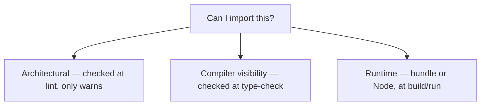
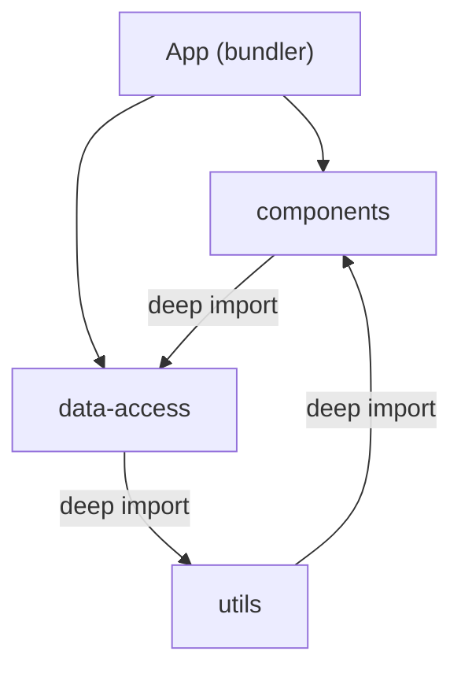
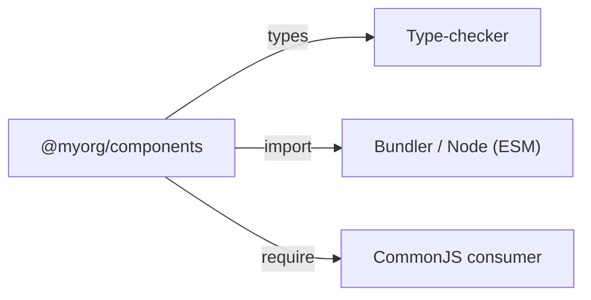

When you join a monorepo, one question sits underneath everything you do: _can I
import this from here — and if I do, what breaks?_ It sounds trivial. It isn't. The
answer depends on where the boundaries between your libraries actually live, and most
people never get a clear picture of that.

## There isn't one boundary. There are three.

The confusion starts because "boundary" means three different things, and people blur
them together. Pull them apart and everything else gets clearer.

Most boundary pain comes from assuming these three line up. By default, they don't — and
when the graph gets tangled, an app and three libraries with deep imports running between
them in a cycle, a static list stops helping:

Every one of those deep imports resolves fine, and none of them should exist.

## The fix: make the library a package

Stop treating a library as a folder of source; treat it as a package that declares its
own public surface through an `exports` map. Now the same library serves every consumer,
each through the right door:

Whatever isn't listed isn't reachable, so the deep-import into internals stops working.
The public API becomes real.

## Where this is heading

Making a library a package fixes the runtime side. But it still hasn't made the compiler
enforce the visibility boundary — that's what project references are for, and that's the
next article.
