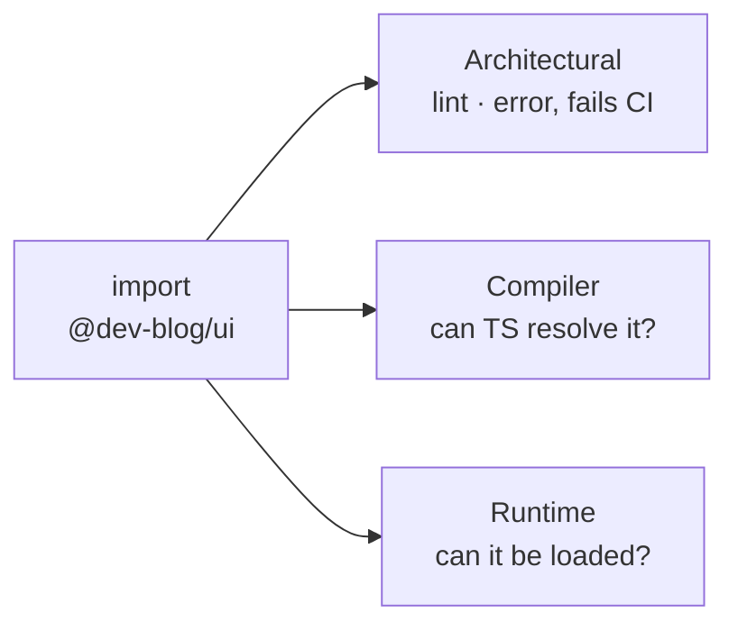
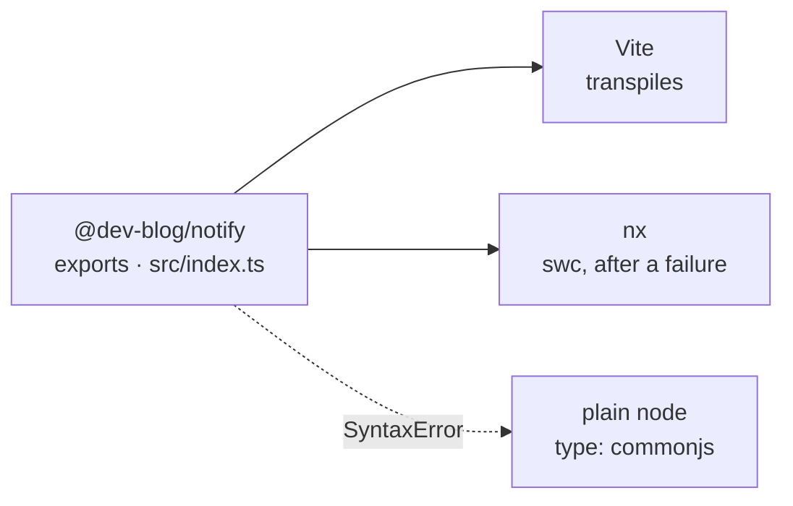
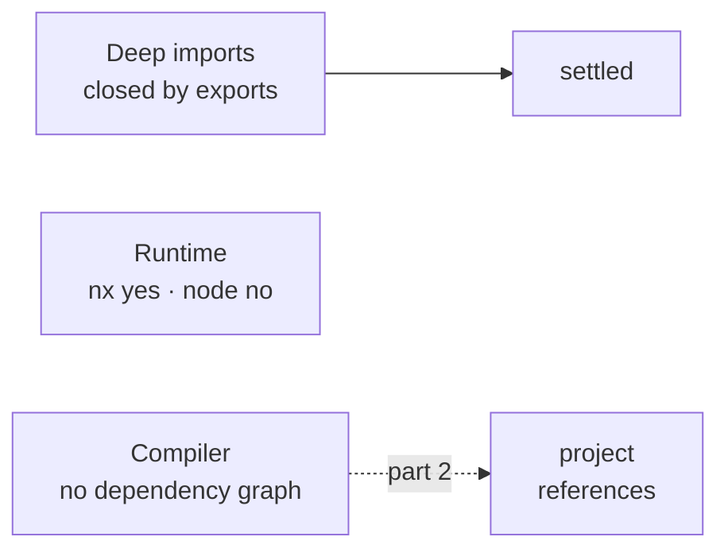

`import { Button } from '@dev-blog/ui'` resolves in my editor, in the dev server
and in the production build, and until I went looking I could not have told you
what made it work. "Can I import this?" turns out to be three separate questions
— is the import allowed, can TypeScript resolve it, can the thing running the
code load the file it lands on — and in this repo a different file answers each
one. Two of those answers disagree, which I only found out when something other
than Vite tried to import a library.

## Three boundaries

The **architectural** boundary asks whether the import is allowed. Here that is
`@nx/enforce-module-boundaries`, set to `error` in `eslint.config.mjs`, and lint
runs in the definition of done and in CI on every pull request — so a violation
fails the build rather than printing a warning. It works off tags: a package
tagged `type:ui` may depend on `type:ui`, `type:theme` and `type:icons`, and
`type:icons` may depend on nothing at all. It reads imports and nothing else; it
does not decide whether the code runs.

The **compiler-visibility** boundary asks whether TypeScript can resolve the
specifier and find types behind it. The **runtime** boundary asks whether the
thing executing the code can load the file it lands on. Those last two disagree
in this repo, and that disagreement is most of this article.



## What makes a folder importable

There is no `paths` alias in this workspace. `grep '"paths"'` across all eighteen
tsconfigs returns nothing, which surprised me, because the alias map is the thing
I would have said a monorepo is made of.

What is there instead: each folder is a real package. pnpm links it into
`node_modules` under its name, and its `package.json` publishes an **exports
map** that says which file each kind of consumer gets.

```json
{
  "name": "@dev-blog/ui",
  "exports": {
    ".": {
      "types": "./src/index.ts",
      "import": "./src/index.ts",
      "default": "./src/index.ts"
    },
    "./package.json": "./package.json"
  }
}
```

What the map does not list is unreachable from outside the package.
`@dev-blog/ui` resolves.
`@dev-blog/ui/src/components/button/button.component` — a real file, exported
through the barrel one line away — does not. The compiler answers
`error TS2307: Cannot find module`, and it answers at the resolver, not at a lint
rule I could switch off with a comment.

That holds only because there is no alias to walk around it. `paths` substitution
runs **before** `exports` is consulted, so a `@dev-blog/ui/*` entry would resolve
the deep import straight past the map —
[TypeScript's own docs say so](https://www.typescriptlang.org/docs/handbook/modules/reference.html#paths)
— which is why there is none.

## The libraries point at their own source

Look at that map again: `types`, `import` and `default` all land on the same
`.ts` file. That is not a shortcut around a build step — there is no build step.
`@dev-blog/ui` has no `build` target at all, because the only thing that consumes
it is the app, and the app is bundled by Vite, which reads TypeScript directly.

So the source-only map carries an assumption: whatever imports these packages can
transpile them. As long as the app is the only consumer that assumption stays
invisible, because Vite is the one answering.

## The consumer that is not Vite

Two nx plugins run outside the app, and both post to Slack through
`@dev-blog/notify` — `plugins/security` when a scheduled scan goes red,
`plugins/release` when a release goes out. `notify` was created in the same
commit as the first of those executors — the security one, which until then sent
its alert from bash inside the workflow. That makes it the first library here
asked to answer a consumer that is not a bundler.

They do have a `build` target, but that is not what runs:
`plugins/release/executors.json` points its implementation at
`./src/executors/notify/executor` — the TypeScript source, not the `dist` the
build produces. So the question lands on Node, and Node has to load a `.ts` file
that imports another `.ts` file.

It does, and the route it takes is not the one I assumed. Run it with
`NX_VERBOSE_LOGGING=true` — without that nothing is printed — and nx says what
happened:

```text
 NX  ESM syntax in TypeScript file parsed as CommonJS; falling back to swc/ts-node + tsconfig-paths. (plugins/release/src/executors/notify/executor.ts)
  Cannot use import statement outside a module
```

nx tries Node's own type stripping first. The executor fails it immediately — it
sits in a package declaring `"type": "commonjs"` and opens with an `import`
statement — so nx catches the error, registers swc, and retries. By the time
`@dev-blog/notify` is imported, it loads through a hook that was installed
because a different file broke.

Take nx out of it and nothing catches anything:

```bash
cd plugins/release && node -e "require('@dev-blog/notify')"
```

```text
Warning: Failed to load the ES module: libs/notify/src/index.ts.
Make sure to set "type": "module" in the nearest package.json file
or use the .mjs extension.

libs/notify/src/index.ts:1
export * from './lib/slack';
^^^^^^

SyntaxError: Unexpected token 'export'
```

Node 24 strips types from a `.ts` file, so TypeScript is not what stopped it —
Node says so itself, blaming the `type` field rather than the syntax it could not
parse. `libs/notify/package.json` declares `"type": "commonjs"` and
`src/index.ts` opens with `export *`. Node believed the package and read the file
as CommonJS, where `export` is a syntax error.



The two plugins are the packages here that are built for anyone, and they carry
the shape that answers both kinds of consumer out of one file:

```json
{
  "exports": {
    ".": {
      "@dev-blog/source": "./src/index.ts",
      "types": "./dist/index.d.ts",
      "import": "./dist/index.js",
      "default": "./dist/index.js"
    }
  }
}
```

`tsconfig.base.json` sets `"customConditions": ["@dev-blog/source"]`, so
TypeScript asks for that key first and lands on the source, while anything
resolving through the standard conditions gets `dist`. Resolvers take the
[first matching condition](https://nodejs.org/api/packages.html#conditional-exports),
which is why the custom one sits at the top. Nothing in the repo imports either
plugin as a module yet — nx loads them by name from `executors.json` — so today
nothing exercises that map.

## Why moduleResolution has two values here

`tsconfig.base.json` sets both `"module"` and `"moduleResolution"` to
`"nodenext"`. Five configs override the resolution to `"bundler"`: the app's, the
component library's, and their spec variants. Four of the five pair it with
`"module": "esnext"`, because the pair has to be consistent — point `tsc` at a
config carrying `bundler` over an inherited `nodenext` and it answers `TS5095`
and `TS5109`. The fifth is `apps/blog/tsconfig.json`, which is exactly that
mismatch and gets away with it because it is a solution file with an empty
`include`: no build ever compiles it.

The split is not app-against-libraries. It is what loads the code: nothing Vite
bundles is ever handed to Node, so `bundler` describes the app and the component
library honestly, while `theme`, `notify` and the plugins stay on `nodenext`
because Node is what reaches them.

What does **not** bridge the two is the exports map. `ui`, `theme` and `notify`
publish the same `src/index.ts` for every condition, so both resolvers land on
the identical file and only the loader behind them differs.

## So, can I import this?

Every row below was run.

| Import                                                | Answer      | Decided by                                        |
| ----------------------------------------------------- | ----------- | ------------------------------------------------- |
| `@dev-blog/ui` from the app                           | resolves    | `exports["."]` → `src/index.ts`, Vite transpiles  |
| `@dev-blog/ui/src/components/button/button.component` | **TS2307**  | not in the exports map, and no alias to bypass it |
| `@dev-blog/theme/styles/tailwind.css`                 | resolves    | `exports["./styles/*"]`, listed on purpose        |
| `@dev-blog/notify` from a plugin, under nx            | resolves    | swc, registered after the native strip failed     |
| `@dev-blog/notify` under plain `node`                 | SyntaxError | `type: commonjs` against an ESM source file       |
| `@dev-blog/ui` from `@dev-blog/notify`                | lint error  | `type:util` may only depend on `type:util`        |

## What the exports map did not fix

It closed deep imports. It did not close the runtime question — it _is_ the
runtime question, and the answer is still split: under nx the import works,
under plain `node` it does not, and the file both of them resolve to is the same
one.

What it says nothing about at all is which package depends on which. TypeScript
still needs that written down separately, in a file next to the imports that
already state it — and when I added the release plugin, that file was missing a
line and the build went red.

That is [part 2](/blog/nx-typescript-project-references).


