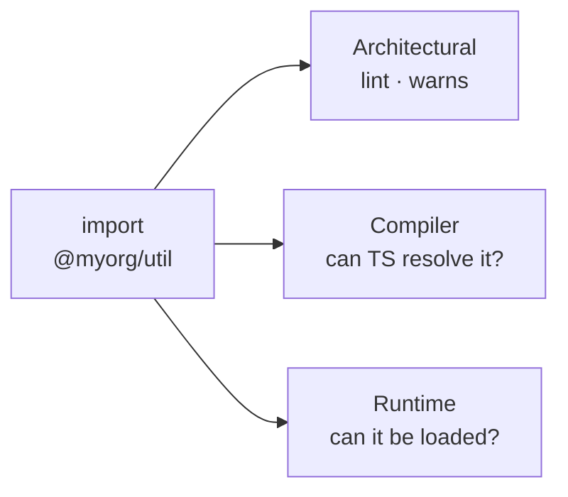
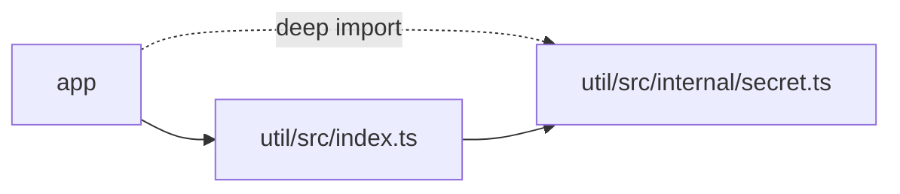
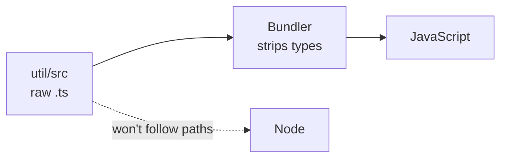
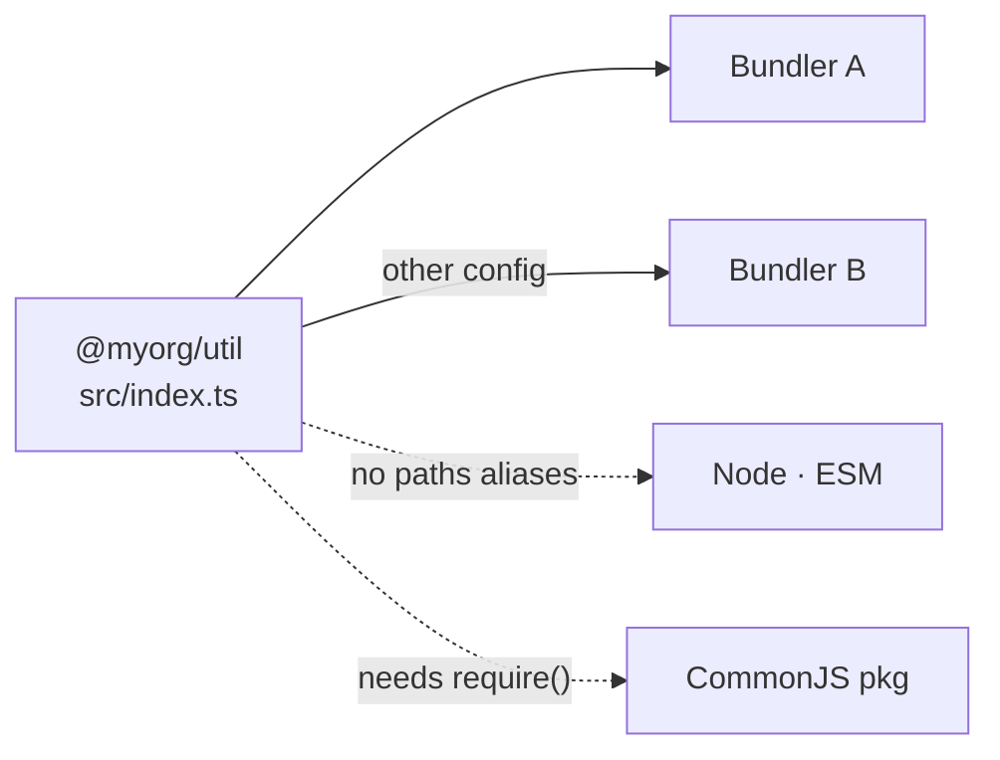
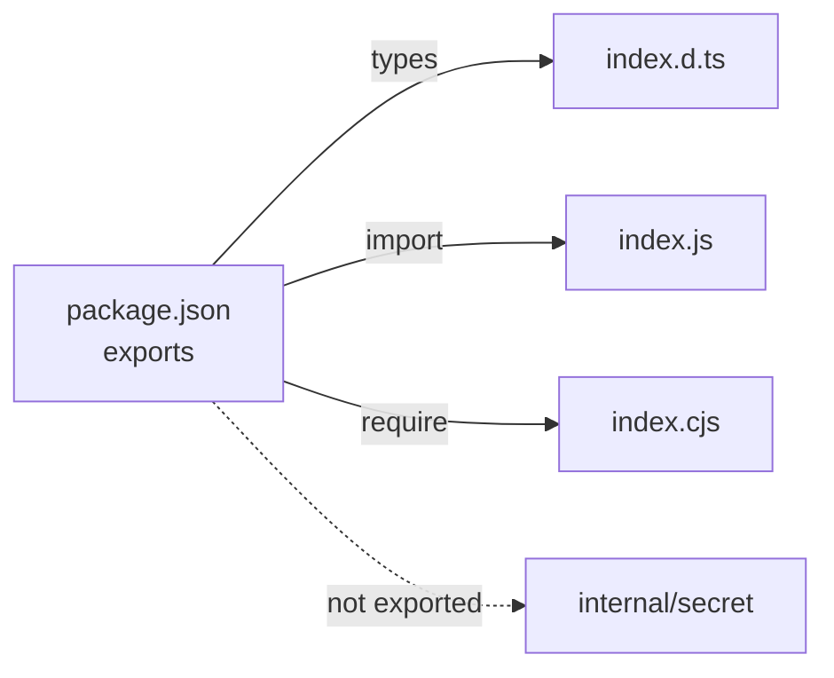
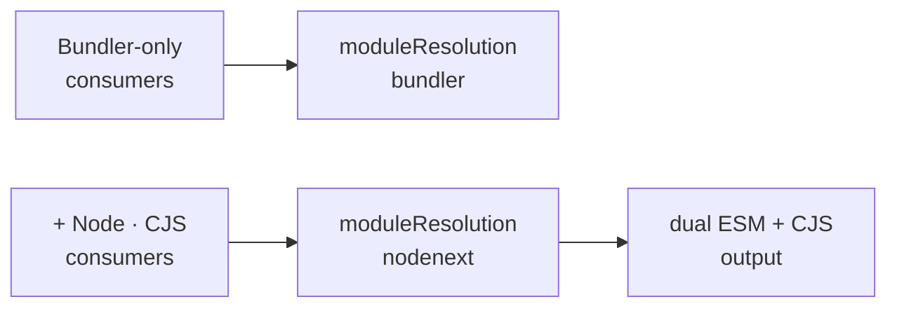
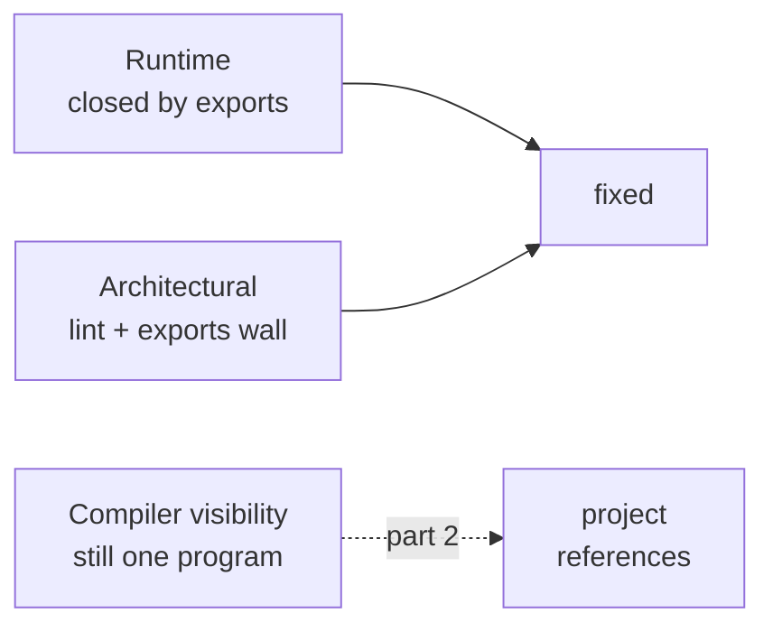

You open a fresh monorepo, type `import { thing } from '@myorg/util'`, and it works. So does `import { internal } from '@myorg/util/src/internal/secret'`. Both resolve, both type-check, both run. It feels like there are no rules. There are rules — they just live in three different places, and only one of them is even trying to stop you.

## 1. There isn't one boundary — there are three

When you ask "can I import this?", you are really asking three separate questions, and they have different answers. There is the **architectural** boundary: is this import _allowed_ by the team's rules? There is the **compiler-visibility** boundary: can TypeScript _resolve and see_ the module you named? And there is the **runtime** boundary: will the thing that actually runs your code — a bundler, or Node — _load_ it?

These are enforced by different tools at different moments. The architectural boundary is a lint rule; it warns. The compiler-visibility boundary is TypeScript answering "I found a type for that." The runtime boundary is whatever loader ships your code deciding it can read the file. Conflate them and every compatibility bug looks like magic.



## 2. By default, everything is one big program

Most workspaces start with `paths` aliases in the root `tsconfig` that point each package name straight at its TypeScript source.

```json
{
  "compilerOptions": {
    "paths": {
      "@myorg/util": ["libs/util/src/index.ts"],
      "@myorg/util/*": ["libs/util/*"]
    }
  }
}
```

That second wildcard is the quiet part. With it, `@myorg/util/src/internal/secret` resolves to `libs/util/src/internal/secret` just as happily as the package name itself. TypeScript now treats the whole workspace as **one program**: every file can see every other file's source. The `index.ts` barrel is a _convention_ — a suggested front door — but nothing enforces it. Deep imports into a library's internals are silently allowed, because to the compiler there are no libraries, only files.



## 3. The hidden assumption

Why does pointing an import at a raw `.ts` file work at all? Because something downstream transpiles it. In dev and in the production build, a bundler reads TypeScript source, strips the types, resolves your aliases, and emits JavaScript. The `paths` model leans entirely on that: it assumes the consumer is a bundler that understands both TypeScript _and_ your alias map.

That assumption is invisible right up until it breaks. Node will run type-strippable TypeScript directly now, but it will never follow your `tsconfig` `paths` aliases — that resolution lives in the compiler and the bundler, not the runtime. And type-stripping only erases annotations; it does not rewrite those alias specifiers into real file paths, nor transform every TS construct into something Node accepts. So the raw-source model — a bare `.ts` reached through an alias — still falls apart the moment the consumer isn't the bundler you configured.



## 4. The compatibility problem

Push a library past that boundary and the cracks show. The moment more than one kind of consumer wants your code, the raw-source model stops being enough. A second bundler with a different config, a Node script, a package that emits CommonJS — each asks the library a different question, and the bare `src/index.ts` can only answer one of them.

Say you add a `@myorg/cli` package that imports the same `@myorg/util` and runs directly under Node. It resolves the bare `@myorg/util` specifier through Node's own rules, finds no `exports` field and no built entry to land on, and fails — right where the app, driven by the bundler and its alias map, never did.



The bundler you set up is fine. Everyone else fails, and they fail for the same underlying reason: there is no map telling each consumer which file to load and in what form.

## 5. The fix: make it a package

A folder becomes a package when its `package.json` publishes an **exports map**. The map routes each consumer to the right entry, using _conditions_ that each tool knows how to read.

```json
{
  "name": "@myorg/util",
  "type": "module",
  "exports": {
    ".": {
      "types": "./dist/index.d.ts",
      "import": "./dist/index.js",
      "require": "./dist/index.cjs"
    }
  }
}
```

Now every boundary has an answer. The type-checker follows `types`. A bundler and Node's ESM loader follow `import`; a CommonJS consumer follows `require`. With `"type": "module"`, a bare `.js` _is_ ESM and `.cjs` is CommonJS, so each condition points at a file in the form it promises.

Order matters, too: resolvers take the _first_ matching condition, so `types` is listed first and more specific conditions sit above generic fallbacks — a broad catch-all placed early would shadow everything below it. And exports is also a _wall_: anything not listed is unreachable from outside the package.

But that wall only binds consumers that resolve through Node. TypeScript still holds the `@myorg/util/*` wildcard from step 2, and `paths` substitution runs _before_ exports is ever consulted — so the compiler, and any bundler honouring that wildcard, would resolve the deep import straight past the wall. So making it a package means dropping the wildcard too, keeping only the barrel alias `@myorg/util` → `src/index.ts`. That removes the deep import's last resolution route, so `@myorg/util/src/internal/secret` now fails everywhere. The surviving barrel alias still pulls `util`'s source into one program, though — exactly the whole-program visibility step 8 comes back to.



## 6. Why moduleResolution suddenly matters

`moduleResolution` is how a library and its consumer agree on what a "module" even is — how specifiers are resolved and which `exports` conditions apply. While everything was one bundled program, `"bundler"` was the honest setting: it mirrors what your bundler does, and it is perfectly fine for bundler-only consumers.

Once a real Node consumer enters, that setting no longer describes reality. You need `"nodenext"`, which resolves the way Node actually does — respecting `import`/`require` conditions and the `type` field. If your consumers span both ESM and CommonJS, that is also where the pressure for **dual output** comes from: you ship both an ESM and a CJS build so each condition has something valid to point at.



## 7. Can I import this?

The same imports, before and after the library becomes a package:

| Import                            | `paths` → raw source                     | Real package + `exports`            |
| --------------------------------- | ---------------------------------------- | ----------------------------------- |
| `@myorg/util` (barrel)            | resolves                                 | resolves via `.`                    |
| `@myorg/util/src/internal/secret` | resolves (deep import open)              | **fails** — no alias / not exported |
| From a second bundler config      | may resolve inconsistently               | resolves via `import`               |
| From Node (ESM)                   | fails — Node won't follow tsconfig paths | resolves via `import` → `.js`       |
| From a CommonJS package           | fails                                    | resolves via `require` → `.cjs`     |
| Type information                  | from source files                        | from `types` → `.d.ts`              |

The package version is stricter and more portable at once: it closes the internals and opens the doors that matter.

## 8. Where this is heading

Notice what the exports map did _not_ fix. It closed the runtime boundary and gave the architectural boundary teeth. But the **compiler-visibility** boundary is still wide open: with `paths` pointing at source, TypeScript still sees the entire workspace as one program and rechecks it as one unit. There is no enforced graph telling the compiler which package depends on which, and no way to type-check or rebuild just what changed.

That gap is exactly what **project references** close — `composite`, `references`, and incremental, per-package type-checking that turns the workspace into a real dependency graph. That is the subject of part 2.


