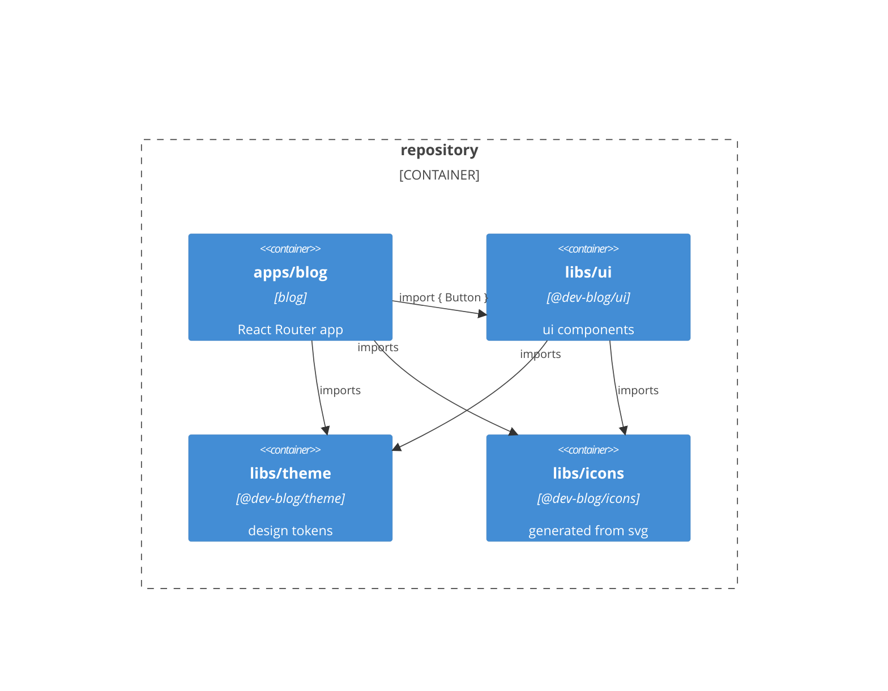
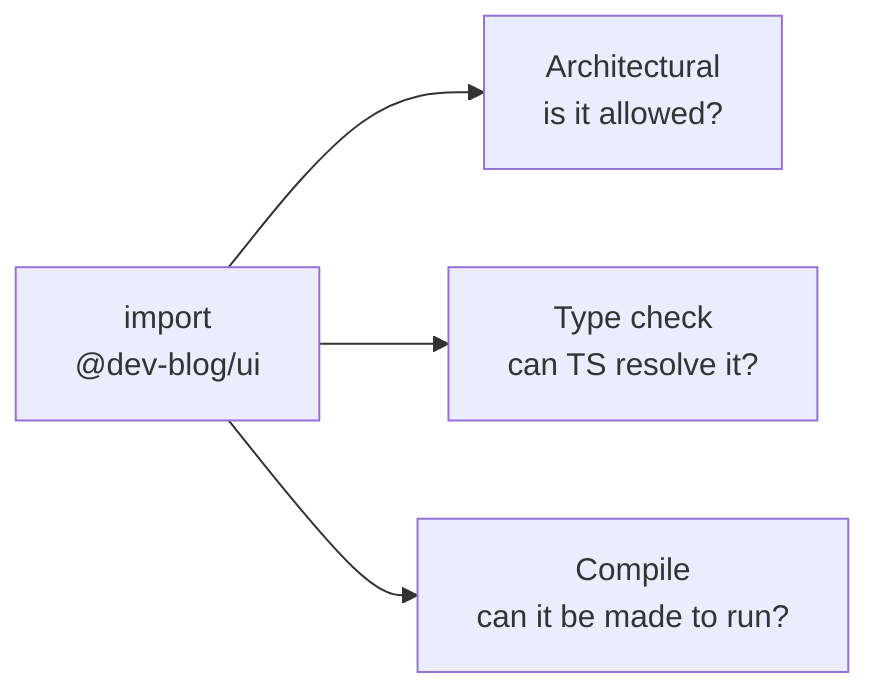
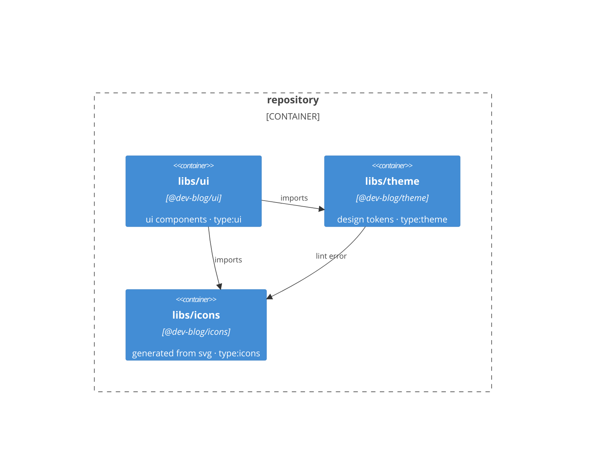
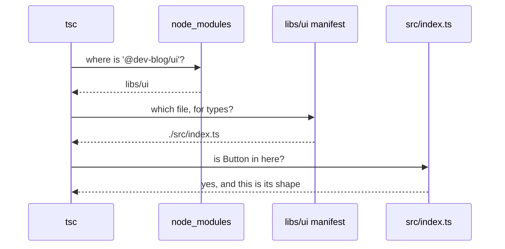

This article takes apart one line of code:

```ts
import { Button } from '@dev-blog/ui';
```

Two packages sit behind it, both in the same repository — an
[Nx](https://nx.dev) monorepo. `apps/blog` is the site you are reading.
`libs/ui` is the component library it imports from, and it answers to the name
`@dev-blog/ui`: a name that looks like npm and is not. The library never leaves
the repository. The package manager links it into the app's `node_modules` from
source, and nothing outside this repo can install it.

Two more libraries sit beside it under the same rules — `@dev-blog/theme` holds
the design tokens, `@dev-blog/icons` the components generated from svg files.
The app imports all three, and `@dev-blog/ui` imports the other two in turn.



The `import { Button } from '@dev-blog/ui'` resolves in my editor, in the dev
server and in the production build. It looks trivial. What makes it work is not.

Nothing answers "can I import this?" as a whole question. Three separate things
each answer a piece of it.

- The **architectural** boundary is a rule you write down, and it decides
  whether the import is allowed in the first place.
- The **type check** decides whether `'@dev-blog/ui'` points at a real file, and
  whether that file has types. `tsc` does it.
- The **compile** boundary decides whether what the specifier lands on can be
  turned into something that runs — and then runs it. Two steps in principle;
  here they are one, because a bundler answers both before shipping and Node
  answers both in the same breath.

They read the same manifests, but none of them reads another's verdict.



## The architectural boundary

The architectural boundary is the rule about which package may depend on which.
It does not care whether TypeScript can find the file. It decides whether the
importing package was supposed to reach for that one at all — and you are the
one who decides that. The rule only enforces it.

If that sounds like a linter — it looks like one and it quacks like one — that
is because it is one: a linting rule. In Nx it is
[`@nx/enforce-module-boundaries`](https://nx.dev/docs/features/enforce-module-boundaries),
set to `error` in `eslint.config.mjs`, and it runs in the same `lint` target as
every other rule. Reach for a package you were not supposed to and the build
goes red.

The three libraries from the diagram are enough to show what it is for.

- `ui` holds the components — the `@dev-blog/ui` this article started with.
- `theme` holds the design tokens.
- `icons` holds the components generated from svg files.

The last two depend on nothing, which is exactly what makes them safe for anyone
to use.

The rule is not written about those three names. It is written about what kind
of thing each one is — a **tag**, in Nx's vocabulary: `ui` carries `type:ui`,
`theme` carries `type:theme`, `icons` carries `type:icons`, and the app carries
`type:app`. The whole rule is four entries:

```js
depConstraints: [
  { sourceTag: 'type:app', onlyDependOnLibsWithTags: ['*'] },
  {
    sourceTag: 'type:ui',
    onlyDependOnLibsWithTags: ['type:ui', 'type:theme', 'type:icons'],
  },
  { sourceTag: 'type:theme', onlyDependOnLibsWithTags: [] },
  { sourceTag: 'type:icons', onlyDependOnLibsWithTags: [] },
];
```

The app may reach for anything, components for tokens and icons, the two leaves
for nothing. Those are permissions, not descriptions: `ui` does import `theme`,
and the empty list is what keeps `theme` from importing back. It is written once
for every library of that kind there will ever be, not for this one.

Now someone in `theme` wants to mark which theme is currently active, and
reaches for the check mark that already exists a folder away:

```ts
import { CheckIcon } from '@dev-blog/icons';
```

Nothing that resolves or loads code complains: the file is there, the types are
fine, the bundler loads it. What changed is the shape of the repository. `theme`
is not a leaf any more, so every package that reaches for a design token now
drags the icon library in behind it — including the ones that never draw an
icon.



The rule does not stop anyone writing that edge — it makes the build fail once
it is written. Lint answers:

```text
libs/theme/src/index.ts
  2:1  error  A project tagged with "type:theme" cannot depend on any libs with tags  @nx/enforce-module-boundaries

✖ 1 problem (1 error, 0 warnings)
```

What is enforced is the direction of each edge, one at a time.

None of this needs a monorepo. The same boundary inside a single app reads
"`src/domain` may not import `src/ui`", enforced by `import/no-restricted-paths`
or dependency-cruiser, which name the folders on each side rather than a tag.
What a monorepo adds is not the boundary, it is one linter that can see every
package at once — across separate repositories, the only thing standing between
you and the wrong edge is whoever reviews the pull request.

Naming folders has a cost: a package added tomorrow is covered only if it lands
inside a path you already wrote down. This is part of why I use Nx for
monorepos, and it is not that the machinery comes written — those two are just
as ready to use. It is that the tag travels with the package: move the folder,
and the constraint still applies to it.

## The type-check boundary

```ts
import { Button } from '@dev-blog/ui';
```

This one asks whether TypeScript can resolve the specifier, and whether there
are types behind it. `tsc` settles it by reading files, never by executing them,
and what it concludes is what the editor shows you: autocomplete, go to
definition, a red squiggle or none.

A specifier is not a path: nothing in `'@dev-blog/ui'` says where a file is.
Something has to turn it into one, and that procedure is called
[**module resolution**](https://www.typescriptlang.org/docs/handbook/modules/theory.html#module-resolution).
Here is the whole process. That line sits in `apps/blog/app/routes/post.tsx`;
the package it names lives in `libs/ui`, linked into the app's `node_modules`.



Now the same walk, slowly: what each step reads, what the package is free to
answer, and the setting that decides the procedure.

**First the search climbs.** It starts in the folder holding the import and goes
up until it finds a `node_modules` with that package inside:

```text
apps/blog/app/routes/   no node_modules here
apps/blog/app/          no node_modules here
apps/blog/              node_modules/@dev-blog/ui  →  libs/ui
```

That third line is there because the app asked for it: a package appears in your
`node_modules` only if you declared it as a dependency, and `apps/blog` lists
`@dev-blog/ui` in its `package.json`.

**Then the package answers.** Note which `package.json` this is: not the app's,
which named the dependency, but the one inside the package that was found —
`libs/ui`'s, describing itself to whoever imports it.

```json
{
  "name": "@dev-blog/ui",
  "exports": {
    ".": {
      "types": "./src/index.ts",
      "import": "./src/index.ts",
      "default": "./src/index.ts"
    },
    "./package.json": "./package.json"
  }
}
```

You do not pick the file. The package does, through that **exports map**.

**And it can answer differently depending on who asks.** The keys are called
**conditions**, one per kind of consumer. Three of them are worth naming.
`types` is the one TypeScript asks for, and it is matched ahead of the others
whatever the code around the import looks like — that is the key that answered
the question this section opened with. The other two are not the keywords they
look like: `import` labels the entry for consumers written as ES modules,
`require` the entry for consumers written as CommonJS.

| Condition | Who asks for it                  | What this map answers           |
| --------- | -------------------------------- | ------------------------------- |
| `types`   | TypeScript, before anything else | `./src/index.ts`                |
| `import`  | a bundler, or Node loading ESM   | `./src/index.ts`                |
| `require` | Node loading CommonJS            | not listed — falls to `default` |
| `default` | anything with no better match    | `./src/index.ts`                |

The list is not closed. A package can invent a condition of its own — a
[custom condition](https://www.typescriptlang.org/tsconfig/#customConditions) —
which only a consumer configured to ask for it will ever match, and that is how
a library hands its own toolchain one file and everyone else another. This map
does not, for a reason the compile boundary comes to.

**And what it does not list is unreachable.** `@dev-blog/ui` resolves;
`@dev-blog/ui/src/components/button/button.component` does not, though it is a
real file and the very one that entry re-exports from. Subpaths exist only if
the map says they do. `tsc` answers `error TS2307: Cannot find module`, and it
answers at the resolver, not at a lint rule I could switch off with a comment.

**Last, the setting.** All of that assumed the map gets opened at all, and that
is not the package's decision. That climb is not the only possible procedure,
and the procedures differ in more than the climb.
[`moduleResolution`](https://www.typescriptlang.org/tsconfig/#moduleResolution)
is where you name the one `tsc` should imitate:

| Value                | Reads the exports map | Relative imports                       |
| -------------------- | --------------------- | -------------------------------------- |
| `node10`             | no, it follows `main` | extension optional                     |
| `node16`, `nodenext` | yes                   | `.js` required in ESM, optional in CJS |
| `bundler`            | yes                   | extension optional                     |

The extension in that middle row is the one the file will have **after** it is
compiled, not the one it has now: in an ESM file you write `./button.js` while
the file on disk is `button.ts`. Drop it and TypeScript refuses; keep it in a
CommonJS file and it is welcome but unnecessary.

`node10` is the legacy mode and
[should no longer be used](https://www.typescriptlang.org/docs/handbook/modules/reference.html#node10-formerly-known-as-node),
but it earns its row: under it the map is never opened. The package still
answers, through `main` for the file and `types` for the declarations — the two
fields packages used before `exports` existed. You get the same fallback from a
package that has no `exports` at all, and plenty of older ones do not.

In `@dev-blog/ui` every key answered the same `.ts` file. The library never
leaves the monorepo, so there is no build output to point at, and no second kind
of consumer to answer differently. That is also the arrangement you would pick
anyway: a declaration file falls out of date the moment you edit the source
without rebuilding, and naming the source leaves nothing that can fall behind. A
published library has a different shape:

```json
{
  "name": "some-published-library",
  "exports": {
    ".": {
      "types": "./dist/index.d.ts",
      "import": "./dist/index.mjs",
      "require": "./dist/index.cjs"
    }
  }
}
```

Three consumers, three files: declarations for the compiler, an ES module for
whoever imports, a CommonJS build for whoever requires. All JavaScript, none of
it the original `.ts`, because a package that ships cannot assume its consumers
will compile TypeScript on its behalf.

Two mechanisms sit alongside all of this and bend it. Worth knowing they exist
before you meet them in someone's config:

- [Path aliases](https://www.typescriptlang.org/docs/handbook/modules/reference.html#paths)
  rewrite a specifier before any of the above runs. Where one matches, it wins,
  and the package's own exports map is never consulted.
- [Project references](https://www.typescriptlang.org/docs/handbook/project-references.html)
  split a build into units built in dependency order, and can let a referenced
  project's generated `.d.ts` stand in for its source.

The first can skip the procedure above entirely, the second changes what it ends
up pointing at. Project references get an article of their own; path aliases are
worth recognising and, in a workspace that already resolves by package name,
worth doing without.

A yes from the type check means TypeScript found the types. It does not mean
anything can load the file behind them.

## The compile boundary

This one asks whether the file behind the specifier can be turned into something
that runs, and then run. Two things have to hold: something has to be able to
compile it, and something has to be able to load what comes out.

Which means this answer, unlike the other two, depends on who is asking. The
rule about which package may depend on which holds no matter who reads the code,
and the type check has only one asker, `tsc`. Here the asker varies.

`tsc` could be that something — compiling TypeScript is what it is for. Here it
is not asked to be: it checks types and emits declarations, and nothing it
writes is ever loaded.

[Vite](https://vite.dev) is. It reads the `.ts` directly, compiles it with
[esbuild](https://esbuild.github.io) and bundles the result, and that is what
ships. On the way it resolves the import itself, under no obligation to land
where `tsc` landed.

The procedure is the one from the last section — climb to `node_modules`, then
read the package's `exports` — asked with a different key. Vite never requests
`types`; in this map it matches `import`. Both land on the same file, but only
because every key in that map names it.

`@dev-blog/ui` is an **internal** library: it has no `build` target, so it
exists only as source for whoever bundles the app — which is why its map had no
`dist` to name. It is still compiled, of course: Vite resolves the import to
`src/index.ts`, treats that source no differently from the app's own, and emits
it into the same bundle. The compiled copy lives inside the app's assets.

### The consumer that is not a bundler

And if Node had to run this library instead — a script, a test runner, anything
that is not bundling first? Try it, and watch how far the procedure gets before
the two consumers part:

```bash
node --input-type=module -e "import '@dev-blog/ui'"
```

```text
Error [ERR_MODULE_NOT_FOUND]: Cannot find module
'…/libs/ui/src/components/accent-switcher/accent-switcher.component'
imported from …/libs/ui/src/index.ts
```

Two steps went exactly as before. Node climbed to `node_modules` and found the
package, and it read the same exports map and got `src/index.ts`. Then it read
the first line of that file:

```ts
export * from './components/accent-switcher/accent-switcher.component';
```

and looked for exactly that path on disk. Nothing is there: the file is
`accent-switcher.component.tsx`, and the specifier carries no extension.

`tsc` did not mind, because `libs/ui` compiles under
`moduleResolution: "bundler"` — the row where the extension is optional, which
is why the import could be written that way at all.

Under `node16` it would not have been optional, and the extension expected is
`./accent-switcher.component.js`: the name the file takes once compiled, not the
`.tsx` it has on disk.

Node applies neither rule, because it never saw the setting — it does not read
`tsconfig.json`. It falls back on its own: in ESM a specifier has to name a file
that is really there. No `.js` has been written, so there is nothing there to
name.

Spelling out the real name would not have saved it either. TypeScript was never
the obstacle — Node got rid of the types on its own — but it did not do that by
compiling: it [erases](https://nodejs.org/api/typescript.html) type syntax,
replacing it with whitespace, and refuses outright anything that would have to
be generated rather than deleted. An `enum`, a namespace, and JSX. That file is
`.tsx`.

Which raises the obvious question: how does Vite manage, on the same file? By
doing more, in both places. For a specifier with no extension it tries a list —
`.mjs`, `.js`, `.mts`, `.ts`, `.jsx`, `.tsx` — and finds the file on the sixth
attempt, where Node took the specifier at its word. And it compiles rather than
erases, so esbuild turning JSX into function calls is ordinary work rather than
the step Node declines to take.

So the specifier is not the thing to fix. Node needs JavaScript, and this
library has none to give: it hands over source and leaves the compiling to
whoever consumes it. To load it, Node needs the library compiled first.

Making a library **buildable** takes two changes. The compiler has to be asked
for JavaScript, which the libraries here are not — they emit declarations only:

```json
{
  "compilerOptions": {
    "outDir": "dist",
    "emitDeclarationOnly": false
  }
}
```

with a target that runs the compiler for its output rather than for its verdict.
Now there is JavaScript, and the map can name it:

```json
{
  "exports": {
    ".": {
      "types": "./dist/index.d.ts",
      "import": "./dist/index.js"
    }
  }
}
```

Both steps exist at last. `tsc` writes `dist/index.js`, Node loads it, and
neither has to know anything about the other's settings — which matters, because
Node could not read them anyway. What you buy is a consumer that does not have
to compile TypeScript. What you pay is an artefact that has to be kept in step
with the source.

None of that shape is hypothetical. The nx plugins in this repository are built
that way — their `dist` holds JavaScript where a library's holds only
declarations — which is what lets Node run them at all.
